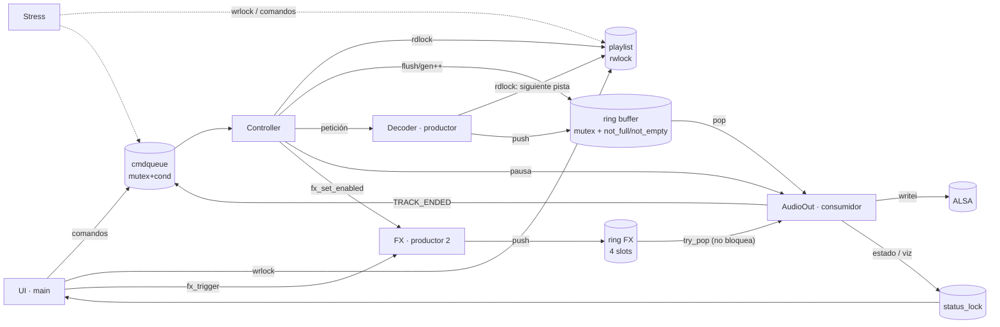
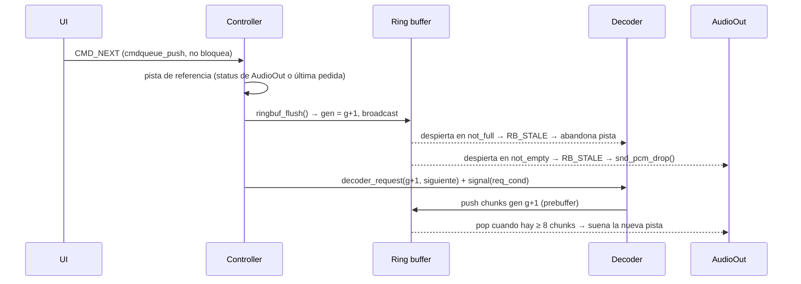

# Protocolo de concurrencia — ConcuPlayer

Nombres: Jhon Jairo Pulgarín y Andrés Felipe Eusse

Este documento describe **qué hilos existen, qué datos comparten, con qué
primitiva se protege cada dato y por qué el diseño no tiene carreras,
interbloqueos ni espera activa**. Solo se usan primitivas POSIX:
`pthread_mutex_t`, `pthread_cond_t`, `pthread_rwlock_t`, más atómicos de
C11 para contadores estadísticos. ALSA, libmpg123 y ncurses solo hacen E/S,
decodificación y dibujo; ninguna resuelve sincronización por nosotros.

---

## 1. Hilos

| Hilo | Archivo | Rol | Se bloquea en |
|---|---|---|---|
| **UI** (main) | `src/ui.c` | Dibuja a ~30 fps, lee el teclado, emite comandos, edita la playlist | `poll()` sobre stdin + `signalfd` (timeout 33 ms) |
| **Controller** | `src/player.c` | Máquina de estados Play/Pause/Stop; único que hace `flush` y pide pistas | `cmdqueue.not_empty` |
| **Decoder** (productor 1) | `src/decoder.c` | Abre WAV/MP3, decodifica, llena el ring buffer, prepara la siguiente pista | `decoder.req_cond`, `ring.not_full` |
| **FX** (productor 2) | `src/fx.c` | Sintetiza efectos de sonido y llena el ring FX | `fx.cond`, `fx_ring.not_full` |
| **AudioOut** (consumidor) | `src/audio_out.c` | Vacía el ring de música hacia ALSA y le **suma** los efectos | `ring.not_empty`, `out.pause_cond`, `snd_pcm_writei` (nunca en el ring FX) |
| **Stress** (opcional) | `src/stress.c` | Usuario sintético: add/remove/move/shuffle/next/seek aleatorios | `pthread_cond_timedwait` |



---

## 2. Datos compartidos y su protección

| Estructura | Primitiva | Escritores | Lectores | Invariante |
|---|---|---|---|---|
| `ringbuf_t` (`ringbuf.c`) | 1 mutex + `not_full` + `not_empty` | Decoder (push), Controller (flush) | AudioOut (pop), UI (snapshot) | `0 ≤ count ≤ RING_SLOTS`; todo chunk en el búfer tiene `gen == rb->gen` |
| `playlist_t` (`playlist.c`) | `pthread_rwlock_t` con **preferencia a escritores** | UI, Stress | Decoder, Controller, UI | Lista doblemente enlazada consistente; ningún puntero a nodo sale del módulo |
| `cmdqueue_t` (`cmdqueue.c`) | mutex + `not_empty` | UI, Stress, AudioOut | Controller | FIFO acotada; el emisor nunca se bloquea |
| `decoder_t.req_*` | mutex + `req_cond` | Controller | Decoder | Una petición nueva reemplaza a la anterior |
| `decoder_t.meta[]` | mismo mutex | Decoder | UI, Controller | caché de metadatos por `track_id` |
| `ringbuf_t` FX (`fx_ring`) | 1 mutex + `not_full` (`not_empty` sin uso) | FX (push), Controller/UI (flush vía `fx_cancel`) | AudioOut (`try_pop`), UI | `count ≤ 4`; prebuffer 0 |
| `fx_t.pending/enabled/cancel` (`fx.c`) | `fx.lock` + `fx.cond` | UI, Stress (disparos), Controller (habilitar) | FX | Solo se aceptan disparos con la música en PLAYING |
| `audio_out_t.paused/shutdown` | `ctl_lock` + `pause_cond` | Controller, main | AudioOut | — |
| `audio_out_t.status/viz` | `status_lock` (hoja) | AudioOut | UI, Controller | Copias por valor |
| `player_t.state/gen/cur_*` | `player.lock` | Controller | UI, main | — |
| `evlog` | mutex (hoja) | todos | UI | anillo de 128 mensajes |
| Contadores (`pushed`, `underruns`, estados de hilo, volumen) | `atomic_*` (C11) | uno | UI | solo estadística / un único valor |

---

## 3. Búfer circular productor–consumidor

* `RING_SLOTS = 32` chunks de `CHUNK_FRAMES = 2048` frames PCM s16 estéreo
  (~1,5 s a 44,1 kHz). Cada chunk lleva cabecera
  `{gen, track_id, track_index, pos_frames, total_frames, rate, channels, flags}`.
* **push** (Decoder): `while (count == RING_SLOTS && gen vigente && !shutdown) wait(not_full)`.
* **pop** (AudioOut): `while (!can_pop && gen sin cambiar && !shutdown) wait(not_empty)`.
* Cada operación hace `signal` de la condición contraria tras modificar
  `count`. Todas las esperas están en `while` → inmunes a despertares espurios.

### 3.1 Generaciones (cancelación instantánea)
`ringbuf_flush()` vacía el búfer, **incrementa `gen`** y hace `broadcast`
de ambas condiciones. Efectos:

* Un productor dormido en `not_full` despierta, ve que su chunk es de una
  generación vieja y recibe `RB_STALE` → abandona la pista al instante.
* Un consumidor dormido en `not_empty` despierta con `RB_STALE` → hace
  `snd_pcm_drop()` y corta el audio ya encolado en el dispositivo.
* Un chunk sacado justo antes del flush se descarta porque su `gen` ya no
  coincide.

Así Next/Prev/Stop/Seek responden en milisegundos sin matar ni recrear
hilos y sin que ningún hilo quede leyendo datos de una pista anterior.

### 3.2 Anti-underrun (sin chasquidos evitables)
* **Prebuffer**: tras un flush, o si el consumidor alcanzó al productor,
  `pop` no entrega datos hasta tener `PREBUFFER_SLOTS = 8` chunks o un
  chunk `EOS`. Evita reproducir “a trozos”.
* El dispositivo ALSA se configura con ~120 ms de búfer propio.
* Toda E/S lenta (abrir archivos, `mpg123_scan`, `snd_pcm_writei`) se hace
  **sin ningún lock tomado**, de modo que nunca retrasa al otro extremo.
* Los underruns reales (`-EPIPE`) se cuentan y se muestran en la UI y se
  recuperan con `snd_pcm_recover()`.

### 3.3 Segundo productor: efectos mezclados sobre la música
Teclas `1`–`5` disparan efectos (aplausos, bocina, campanas, láser, tambor)
sintetizados por el hilo **FX**, que suenan *encima* de la canción.
Es el patrón **varios productores → un consumidor** con dos búferes
independientes:

* **Disparo (UI → FX):** `fx_trigger()` agrega el id a `pending` bajo
  `fx.lock` y hace `signal(fx.cond)`. Nunca bloquea a la UI.
* **Productor FX:** duerme en `fx.cond` mientras no haya efectos activos.
  Con efectos activos sintetiza bloques cortos (512 frames ≈ 12 ms) **fuera
  de todo lock**, mezcla hasta 6 voces entre sí y hace `ringbuf_push()`
  en un ring de **4 slots**; si se llena duerme en `not_full`, de modo que
  el consumidor marca también el ritmo de los efectos.
* **Consumidor:** antes de escribir cada bloque de música en ALSA llama a
  `ringbuf_try_pop()` sobre el ring FX y **suma** las muestras (con
  saturación a ±32767). `try_pop` **no espera**: si no hay efectos devuelve
  `RB_EMPTY` y la música sale tal cual. Así **un productor nunca puede
  detener al otro**: el consumidor solo se bloquea por la música.
* **Ring pequeño = baja latencia:** a lo sumo 4 × 12 ms de efectos en cola.
* **Habilitación:** tras cada comando el Controller llama a
  `fx_set_enabled(state == PLAYING)`. Al deshabilitar (pausa, stop, fin
  de lista) se vacían los disparos pendientes y se hace flush del ring FX
  **bajo el mismo `fx.lock`** que usa `fx_trigger()`, de modo que no existe
  ventana en la que un disparo quede “huérfano” y suene más tarde.
* **Cancelación (`0`):** `fx_cancel()` hace flush del ring FX (nueva
  generación). El productor recibe `RB_STALE` y descarta sus voces; el
  consumidor descarta el bloque FX a medio mezclar si su `gen` ya no es
  la vigente. La generación que el productor estampa en cada bloque se lee
  con `fx.lock` tomado (orden `fx.lock → fx_ring.lock`), por lo que un
  bloque sintetizado antes de una cancelación nunca se acepta después.
* La frecuencia de síntesis se toma de `out.device_rate` (atómico), así los
  efectos coinciden con la frecuencia a la que suena la canción actual.

---

## 4. Playlist: Lectores–Escritores

* `pthread_rwlock_t` configurado con
  `PTHREAD_RWLOCK_PREFER_WRITER_NONRECURSIVE_NP`: con lectores frecuentes
  (UI a 30 fps, Decoder) un comando del usuario no sufre inanición.
* **Regla de oro:** las consultas copian los datos (`track_info_t`) mientras
  tienen el `rdlock`; fuera del módulo las pistas se identifican por un
  `id` único y monótono. Ningún hilo guarda punteros a nodos, por lo que
  eliminar cualquier nodo —incluso el que está sonando— no puede causar
  *use-after-free*.
* `malloc`/`free` se hacen fuera de la sección crítica cuando es posible
  (`playlist_add` reserva antes; `playlist_clear` desengancha la lista bajo
  `wrlock` y la libera después).
* **Pista actual eliminada:** el Decoder recuerda la posición (`track_index`)
  de la pista que decodifica. Si al prepararse la siguiente el `id` ya no
  existe, `playlist_next_after(id, hint_index)` devuelve el elemento que
  ahora ocupa esa posición, que es exactamente el que la seguía.
* `version` (atómico) cambia con cada escritura; la UI solo recopia la
  lista cuando cambia.

---

## 5. Control asíncrono de eventos

La UI nunca bloquea: cada tecla se convierte en un `command_t` y se
encola con `cmdqueue_push()` (si la cola está llena se descarta y se
registra). El Controller procesa los comandos **en serie**, de modo que dos
transiciones nunca compiten entre sí.



**Pausa:** el Controller pone `paused = true` y hace `broadcast(pause_cond)`.
AudioOut, al terminar el `writei` en curso (≤ un periodo, ~30 ms), pausa el
dispositivo (`snd_pcm_pause` o `drop`) y duerme en `pause_cond`. El Decoder
sigue hasta llenar el búfer y luego duerme en `not_full`. **Nadie gira.**

**Fin de lista:** el Decoder empuja un chunk `EOS`; AudioOut, al sacarlo,
envía `CMD_TRACK_ENDED(gen)`. El Controller solo lo acepta si `gen` es la
vigente (un EOS viejo tras un Next se ignora).

---

## 6. Orden global de locks (prevención de interbloqueos)

```
cmdqueue → playlist(rwlock) → player.lock → decoder.lock → fx.lock → ring.lock / fx_ring.lock → audio.ctl_lock → audio.status_lock → evlog
```

* En la práctica **ninguna función sostiene dos locks a la vez**: cada
  operación toma el lock de *su* módulo, copia/modifica y lo suelta antes
  de llamar a otro módulo. Las únicas anidaciones existentes son
  `player.lock → evlog` (evlog es hoja y no llama a nadie) y
  `fx.lock → fx_ring.lock` (lectura de la generación y flush en
  `fx_cancel`/`fx_set_enabled`); el productor FX nunca toma `fx.lock`
  mientras espera en el ring, así que no hay ciclo.
* Ningún lock se mantiene durante E/S bloqueante (archivo, ALSA, mpg123,
  ncurses).
* Como no hay ciclos posibles en el grafo de espera, no hay interbloqueo.
* La UI y el Controller nunca se bloquean esperando a Decoder ni AudioOut
  (todas sus llamadas hacia ellos son no bloqueantes).

---

## 7. Apagado ordenado (sin fugas)

1. `stress_stop()` — señaliza su cond y `pthread_join`.
2. `CMD_QUIT` + `cmdqueue_close()` → `player_join()`.
3. `decoder_shutdown()`, `fx_shutdown()`, `audio_out_shutdown()`,
   `ringbuf_shutdown()` de ambos búferes:
   ponen `shutdown = true` y hacen `broadcast` de **todas** las condiciones,
   así ningún hilo queda dormido para siempre.
4. `decoder_join()`, `fx_join()`, `audio_out_join()` (cierra ALSA).
5. Se destruyen ring buffer, playlist, cola y mutex/conds.

Las señales `SIGINT/SIGTERM` se bloquean antes de crear hilos (los hilos
heredan la máscara) y se atienden solo en el hilo principal mediante
`signalfd` (UI) o `sigtimedwait` (headless). `SIGWINCH` solo lo recibe el
hilo de ncurses.

---

## 8. Evidencia de verificación

| Prueba | Comando | Qué demuestra |
|---|---|---|
| Estrés del ring buffer | `make test-tsan` (`tests/test_ringbuf.c`) | Orden e integridad de datos con flush concurrentes; sin carreras |
| Ring FX no bloqueante | `make test-tsan` (`test_fx_ring`) | `try_pop` nunca bloquea; orden e integridad con cancelaciones concurrentes |
| Estrés de la playlist | `make test-tsan` (`tests/test_playlist.c`) | 4 lectores + 3 escritores; sin use-after-free (ASan) ni carreras (TSan) |
| Reproductor bajo TSan | `make tsan && ./concuplayer-tsan --headless --null --stress assets` | Todo el sistema con usuario sintético |
| Reproductor bajo ASan/UBSan | `make debug && ./concuplayer-asan --headless --null --stress assets` | Sin fugas ni accesos inválidos |
| Valgrind | `make valgrind` | Sin fugas al terminar |
